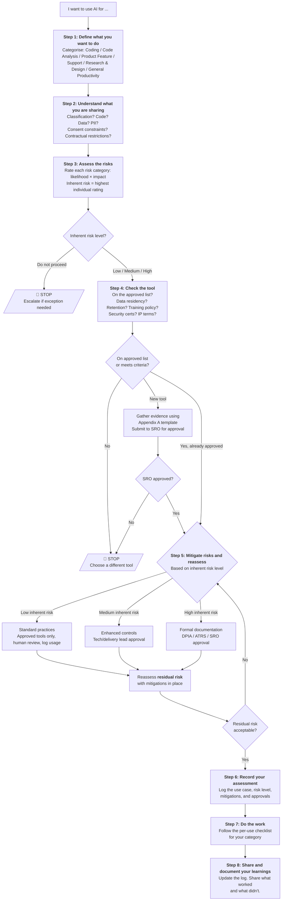

# A Practical Risk-Based Approach to the Use of AI in Projects

## 1. Introduction and Purpose

This document provides a practical framework for delivery teams to assess whether and how to use AI for specific activities on government IT projects. It covers the full range of AI use that teams encounter during delivery:

- **AI-assisted coding** — using AI tools to help write, complete, review, or debug code
- **AI-assisted code analysis** — using AI to analyse existing codebases, identify patterns, map dependencies, or assess technical debt and security issues
- **AI-powered product features** — building AI capabilities into the products and services being delivered to end users
- **AI-assisted support** — using AI to help process, triage, respond to, or automate support requests and service desk operations
- **AI-assisted research and design** — using AI to support user research analysis, content drafting, or design exploration
- **AI-assisted general productivity** — using AI for routine office tasks such as meeting transcription, report drafting, translation, or summarisation

The goal is not to prevent the use of AI. AI tools can significantly improve the quality and efficiency of delivery work when used well. The goal is to ensure that teams make informed decisions about AI use by understanding the risks involved and applying proportionate safeguards.

### How to use this document

This document is structured as an assessment workflow. When you want to use AI for a specific activity, work through Steps 1 to 8. Each step builds on the previous one, guiding you from defining what you want to do, through assessing risks and recording your assessment, to doing the work with the right safeguards in place.

If you are already familiar with the framework and just need the checklist for your activity type, go directly to [Step 7](step-7-checklists.md).

### The process at a glance

The framework follows eight steps. Each builds on the previous one:

1. **[Define what you want to do](step-1-define.md)** — describe your intended AI use and categorise it (coding, code analysis, product feature, support, research & design, or general productivity)
2. **[Understand what you are sharing](step-2-understand-data.md)** — assess the code and data that will be shared with the AI tool, including classification, PII, consent constraints, and commercial sensitivity
3. **[Assess the risks](step-3-assess-risks.md)** — rate each risk category (data leakage, accuracy, accountability, bias, IP, over-reliance, supply chain, prompt injection) by likelihood and impact to determine the **inherent** risk level (before mitigations)
4. **[Check the tool](step-4-check-tool.md)** — confirm the AI tool meets baseline criteria for data residency, retention, security, and IP terms
5. **[Mitigate risks and reassess](step-5-mitigate.md)** — apply proportionate safeguards based on the inherent risk, reassess the **residual** risk, and obtain the required approvals
6. **[Record your assessment](step-6-record.md)** — log the use case, risk level, mitigations, and approvals before starting work
7. **[Do the work](step-7-checklists.md)** — follow the per-use checklist for your category (before, during, and after)
8. **[Share and document your learnings](step-8-share.md)** — update the usage log, share what worked and what didn't, and contribute to the wider knowledge base

### The "stricter wins" principle

Where a client or government department has its own AI policy, the more restrictive position on any given point takes precedence. For example, if this framework permits the use of cloud-hosted AI tools for OFFICIAL data but the client prohibits it, follow the client's position. This document sets a baseline — it should never be used to justify a less restrictive approach than the client requires.

### Keeping this document current

The AI landscape — tools, capabilities, risks, and regulation — is evolving rapidly. This document should be reviewed at least every six months and updated when significant changes occur in government guidance, regulation, or the risk landscape. The date of the last review should be recorded here.

**Last reviewed:** [Date]

### Staff responsibilities and training

Anyone using AI tools on project work is personally responsible for the outputs they produce, just as they would be for any other work product. AI-generated code, analysis, content, or advice that you submit, commit, publish, or act upon is your responsibility — treat it as your own work and apply the same quality standards.

Before using AI tools on a project, staff should:

- Understand the data classification levels relevant to their work and the handling requirements for each
- Be aware of their data protection obligations, including when a Data Protection Impact Assessment (DPIA) is required
- Be familiar with this framework and able to apply it to their intended AI use
- Know which tools are approved for use and where to find the approved tools list

Organisations should provide AI awareness training that covers responsible use, risks, and this framework. Consider establishing AI champions within teams who can support colleagues and share good practices.

### Approved tools and public AI

Publicly available AI tools — including free or consumer versions of ChatGPT, Google Gemini, Claude, and others — **must not be used for work-related information**. These consumer tools often store user inputs, may use them to train or improve their models, and operate under terms and conditions that do not provide the data handling guarantees required for government work. They are not the same as enterprise or approved versions of the same products.

Each project or organisation should maintain an **approved tools list** — a register of AI tools that have been assessed and authorised for use on project work (see [Step 4](step-4-check-tool.md)). Only tools on this list may be used. If you want to use a tool that is not on the list, you must have it assessed and approved before use — do not use it first and seek approval later.

The use of unapproved AI tools by staff — sometimes called "shadow AI" — is a significant risk. It bypasses the safeguards in this framework and may breach data protection obligations, contractual requirements, or government security policies. If you become aware of unapproved AI tool use, raise it with your delivery lead or SRO.

---

## 2. Alignment with UK Government Guidance

This framework is designed to be consistent with current UK Government guidance on AI. It does not replace that guidance but provides a practical mechanism for delivery teams to apply it in their day-to-day work.

The key government publications this framework aligns with are:

- **AI Playbook for the UK Government** (February 2025) — the primary government guidance on AI use, setting out 10 principles for responsible AI including knowing AI's limitations, using AI lawfully and ethically, and maintaining meaningful human control. This framework operationalises those principles into a practical assessment process.

- **Data and AI Ethics Framework** (updated December 2025) — provides ethical principles covering privacy, fairness, accountability, and transparency, along with a self-assessment tool. The risk categories in [Step 3](step-3-assess-risks.md) of this framework map directly to these principles.

- **Algorithmic Transparency Recording Standard (ATRS)** — mandatory for central government departments since 2024. If you are building AI-powered product features or AI-assisted support that involves algorithmic decision-making affecting how requests are handled (see [Step 1](step-1-define.md)), you may need to complete an ATRS record. This is addressed in [Step 5](step-5-mitigate.md) and the relevant checklists in [Step 7](step-7-checklists.md).

- **Code of Practice for the Cyber Security of AI** (January 2025) — establishes baseline security requirements for AI systems across five lifecycle phases. The tool criteria in [Step 4](step-4-check-tool.md) and the security considerations in [Step 3](step-3-assess-risks.md) reflect these requirements.

- **NCSC guidance on prompt injection** (December 2025) — the National Cyber Security Centre's position that prompt injection "may never be totally mitigated" and that LLMs should be treated as "inherently confusable deputies." This informs the prompt injection risk category in [Step 3](step-3-assess-risks.md) and the emphasis on deterministic safeguards and least privilege throughout the checklists.

- **Government Security Classifications Policy** — the data classification framework (OFFICIAL, OFFICIAL-SENSITIVE, SECRET, TOP SECRET) is one of the key inputs to the data assessment in [Step 2](step-2-understand-data.md).

- **ICO AI and Data Protection Risk Toolkit** — the Information Commissioner's Office's practical toolkit for assessing AI systems against UK GDPR requirements, covering accountability, transparency, lawfulness, accuracy, fairness, security, individual rights, and automated decision-making. The risk assessment in [Step 3](step-3-assess-risks.md) and the DPIA requirements in [Step 5](step-5-mitigate.md) align with this toolkit.

- **ICO Toolkit for Data Analytics** — the ICO's introductory assessment for organisations considering data analytics, covering lawfulness, accountability, data protection principles, and data subject rights. Useful for teams new to AI-assisted data processing.

- **Understanding AI Ethics and Safety** (Office for AI / GDS / Alan Turing Institute) — establishes the SUM values framework (respect dignity, connect sincerely, care for wellbeing, protect social values) and the FAST Track principles (Fairness, Accountability, Sustainability, Transparency) for public sector AI. The ethical considerations throughout this framework reflect these principles.

- **UNESCO Recommendation on the Ethics of AI** (2021) — adopted by all 193 UNESCO member states, establishing principles including proportionality, safety, privacy, accountability, transparency, and human oversight. Provides the broader ethical context for responsible AI use.

- **AI Action Plan for Justice** (2025) — for teams working on justice sector projects, this sets out the Ministry of Justice's approach to AI adoption, including the role of the Justice AI Unit, the SAFE-D ethical principles (Sustainability, Accountability, Fairness, Explainability, Data Responsibility), and approved tools. Justice sector teams should follow this plan alongside this framework.

A detailed mapping of this framework's steps to the AI Playbook's 10 principles and other referenced frameworks is provided in [Appendix C](appendix-c-playbook-mapping.md).

---

## Contents

### The Assessment Framework

| Step | Description |
| ---- | ---- |
| [Step 1: Define What You Want to Do](step-1-define.md) | Categorise your AI use into one of six types |
| [Step 2: Understand What You Are Sharing](step-2-understand-data.md) | Assess the code and data you will share with the AI tool |
| [Step 3: Assess the Risks](step-3-assess-risks.md) | Rate 8 risk categories to determine the inherent risk level |
| [Step 4: Check the Tool](step-4-check-tool.md) | Confirm the AI tool meets baseline criteria |
| [Step 5: Mitigate Risks and Reassess](step-5-mitigate.md) | Apply mitigations and reassess the residual risk |
| [Step 6: Record Your Assessment](step-6-record.md) | Log the use case, risks, mitigations, and approvals |
| [Step 7: Do the Work](step-7-checklists.md) | Follow the per-use checklist for your category |
| [Step 8: Share and Document Your Learnings](step-8-share.md) | Update the log and share what you learned |

### Appendices

| Appendix | Description |
| ---- | ---- |
| [Appendix A: Tool Evaluation Template](appendix-a-tool-evaluation.md) | Template for assessing whether an AI tool meets baseline criteria |
| [Appendix B: Risk Assessment Template](appendix-b-risk-template.md) | Template for completing Steps 3 and 5 |
| [Appendix C: Mapping to the AI Playbook](appendix-c-playbook-mapping.md) | How this framework maps to the AI Playbook's 10 principles |
| [Appendix D: Glossary](appendix-d-glossary.md) | Definitions of key terms |
| [Appendix E: Worked Examples](appendix-e-worked-examples.md) | Four worked examples covering different AI use types |
